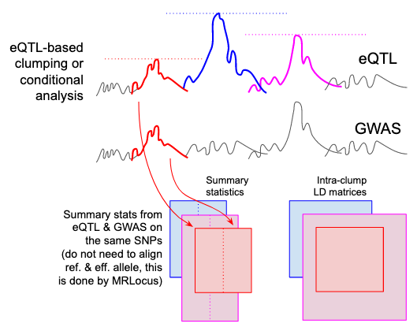

# MRLocus

### About

MRLocus is a statistical method providing Mendelian Randomization
analysis per locus, leveraging eQTL and GWAS summary statistics, for
estimation of gene-to-trait effect size and dispersion.

See `Get started` tab for software vignette, and `Reference` tab for
manual pages of the individual functions.

### Publication

Anqi Zhu\*, Nana Matoba\*, Emma P. Wilson, Amanda L. Tapia, Yun Li,
Joseph G. Ibrahim, Jason L. Stein, Michael I. Love.
"MRLocus: identifying causal genes mediating a trait through Bayesian
estimation of allelic heterogeneity"
*PLOS Genetics*, 17(4): e1009455 (2021).
[doi: 10.1371/journal.pgen.1009455](https://doi.org/10.1371/journal.pgen.1009455)

\* Both authors contributed equally to this work.

### Data input

MRLocus uses multiple, distinct eQTL signals in order to perform
Mendelian Randomization investigating the effect of gene expression on
a downstream GWAS trait. It takes as input the output of a clumping
procedure, such
as [PLINK clump](https://zzz.bwh.harvard.edu/plink/clump.shtml), or
ideally,
[conditional analysis](https://pubmed.ncbi.nlm.nih.gov/28165122/) of
the eQTL dataset.
In the MRLocus paper, we use the PLINK clump settings,
`--clump-p1 0.001 --clump-p2 1 --clump-r2 0.1 --clump-kb 500`,
where `p1` refers to the eQTL summary associations. 
MRLocus can then be run on loci that contain more than one
clump.



MRLocus then requires:

1. Summary statistics for each clump
2. Intra-clump LD matrices

Summary statistics for both eQTL and GWAS (effect size, standard
error, reference allele, effect allele) of the SNPs in each clump or
conditionally distinct cluster should be gathered into tables, making
sure the index eSNP is also included. The eQTL and GWAS studies can
have different coding of reference and effect alleles, MRLocus has a
function that will deal with this internally, to avoid users having to
flip alleles and effect sizes themselves.

After having prepared these multiple tables for each clump, they
should be read into R as a list of `data.frame`. The LD matrices for
each clump likewise should be read in as a list of matrices (in the
same order as the summary statistics list). These lists can be read in
with code such as:

```
sum_stat <- lapply(sum_stat_files, read.delim)
ld_mat <- lapply(ld_mat_files, function(f) as.matrix(read.table(f)))
```

The steps following reading in the summary statistics and LD matrices
into R are described in the vignette under the `Get started` tab above.

Finally, we note that MRLocus offers its own colocalization model, or
alternatively, MRLocus slope fitting can be run after performing 
[eCAVIAR](https://pubmed.ncbi.nlm.nih.gov/27866706/) colocalization on
the SNPs within each clump. The alternative steps used in the case
of eCAVIAR colocalization are discussed in the vignette under `Get
started` tab.

### Installation

The *mrlocus* R package can be installed using *devtools*. Note that
*mrlocus* uses RStan, and so involves compilation of C++ code.
Installation will take longer than with R packages not containing code
to be compiled.

```
library(devtools)
install_github("mikelove/mrlocus")
```

### Issues

For bug reports, feature requests, or questions, please post 
[here](https://github.com/mikelove/mrlocus/issues/new/choose).
